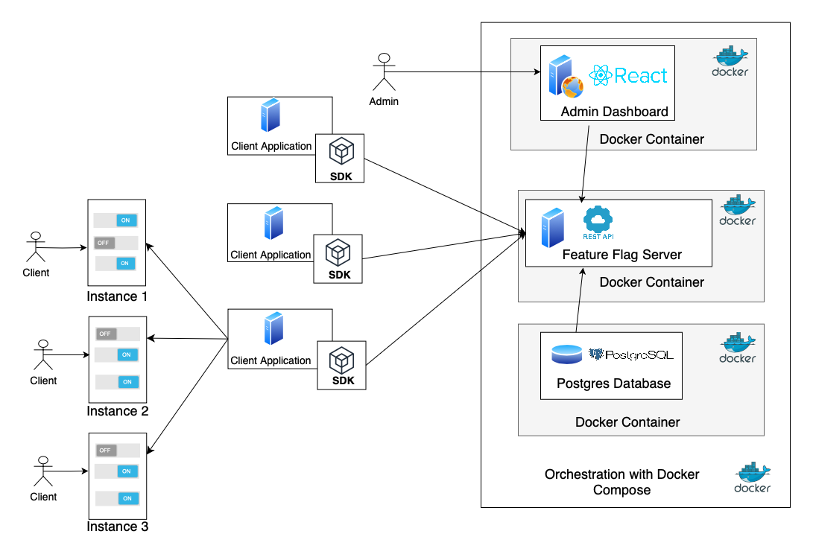

# ZKFlag: Privacy-First Feature Flags with Zero-Knowledge Proofs

Feature flags are mechanisms that provide flexible deployment by 
enabling or disabling certain features of an application in real-time without modifying its source code. This technology helps developers accelerate the delivery of new features while reducing the risks associated with implementation through strategies such as progressive rollout.

ZKFlag provides a **feature flags as a service** solution through a centralized server, allowing users to easily manage the activation and deactivation of features across multiple applications in a flexible and personalized way.

The platform provides a significant security advantage over other feature flag platforms by integrating **Zero Knowledge Proof (ZKP)** technology. Through ZKP, we can evaluate flags based on sensitive information, without explicitly disclosing this data to the feature flags server.

<div align="center">
  
</div>

## 1. Starting Server

To install and use our app, clone the repository using the following command:

```bash
git clone https://github.com/biancamircea/ZKFlag.git
```

Next, navigate to the ZKFlag folder inside the repository and start the feature flags server along with the admin dashboard and the necessary services:

```bash
docker-compose up
```

Once the services are up and running, you can manage the server at: http://localhost:5173

### Initial Setup
Initially, the database will contain a single user with the role of "System Admin". This role ensures secure and controlled access to all server resources. Specifically, the System Admin can create and delete users, projects, instances, and environments, and assign users to projects/instances based on their roles.

### User Roles

There are 3 types of roles:

- **System Admin**: Full control over the server's resources.
- **Project Admin**: Can create toggles and set activation constraints for them within their projects.
- **Instance Admin**: Can enable/disable toggles at the instance level, based on available environments. Additionally, the Instance Admin can set a payload at the environment level and modify constraint values based on the instance's needs.

## 2. Integrating with Client Applications
### 2.1. Integration with SDK

To integrate the server with Java applications, use the following steps:

1. In the pom.xml file of your client application, add the dependency:
```bash
<dependency>
  <groupId>ro.mta.sdk</groupId>
  <artifactId>toggle-system</artifactId>
  <version>1.0.10</version>
</dependency>
```

2. To create a client instance, use the following code:

```bash
ToggleSystemConfig toggleSystemConfig = ToggleSystemConfig.builder()
            .toggleServerAPI("http://localhost:8080")
            .apiKey("<api-key>")
            .build();
ToggleSystemClient toggleSystem = new ToggleSystemClient(toggleSystemConfig);
```

The API key is created by the Instance Admin and represents a specific project, instance, and environment.

3. To evaluate a flag, you have two options:

With constraints:

```bash
ToggleSystemContext context = ToggleSystemContext.builder()
                .addProperty("key", "value")
                .build();
boolean isEnabled = toggleSystemClient.isEnabled("toggle_name", context);
```

Without constraints:

```bash
boolean isEnabled = toggleSystemClient.isEnabled("toggle_name");
```

4. To retrieve the associated payload:

```bash
toggleSystem.getPayload("toggle_name");  // Without context
toggleSystem.getPayload("toggle_name", context);  // With context
```

### 2.2 Integration with REST API

For integrating the server into frontend applications or other programming languages, you can use  REST API.
An example of integration in JavaScript:

```bash
const response = await fetch("http://localhost:8080/client/evaluate", {
    method: "POST",
    headers: {
        "Content-Type": "application/json",
        "Authorization": `Bearer ${process.env.REACT_APP_API_TOKEN}`,
    },
    body: JSON.stringify({
        toggleName: featureName,
        contextFields: contextFields,
    }),
});

if (!response.ok) {
    throw new Error(`Failed to fetch feature ${featureName}`);
}

const data = await response.json();
console.log(`Feature status for ${featureName}:`, data.enabled);

const featureData = {
    enabled: data.enabled,
    payload: data.payload,
};
```


In the DemoApplication directory, you can find detailed examples of integration for both the backend and the frontend.


